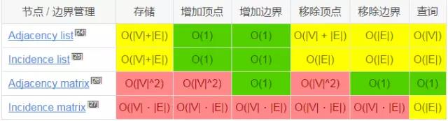

## 算法

> 算法（Algorithm）是指解题方案的准确而完整的描述，是一系列解决问题的清晰指令，算法代表着用系统的方法描述解决问题的策略机制。也就是说，能够对一定规范的输入，在有限时间内获得所要求的输出。如果一个算法有缺陷，或不适合于某个问题，执行这个算法将不会解决这个问题。不同的算法可能用不同的时间、空间或效率来完成同样的任务。一个算法的优劣可以用空间复杂度与时间复杂度来衡量。

### 算法的特征

- 有穷性

算法的有穷性是指算法必须能在执行有限个步骤之后终止； 

- 确定性

算法的每一步骤必须有确切的定义； 

- 输入

一个算法有0个或多个输入 

- 输出

一个算法有一个或多个输出，以反映对输入数据加工后的结果 

- 可行性

算法中执行的任何计算步骤都是可以被分解为基本的可执行的操作步 

### 时间复杂度

时间复杂度是执行算法所需要的工作量，一般来说，计算机算法是问题规模n 的函数f(n)，算法的时间复杂度也因此记做。

`T(n)=Ο(f(n))`

因此，问题的规模n 越大，算法执行的时间的增长率与f(n) 的增长率正相关

### 空间复杂度

算法的空间复杂度是指算法需要消耗的内存空间。其计算和表示方法与时间 复杂度类似。

<table style="border=1;border-collapse: collapse;">
    <tr>
        <th rowspan="2">类别</th>
        <th rowspan="2">排序方法</th>
        <th colspan="3">时间复杂度</th>
        <th rowspan="2">空间复杂度</th>
        <th rowspan="2">稳定性</th>
        <th rowspan="2">复杂度</th>
    </tr>
        <td>平均情况</td>
        <td>最好情况</td>
        <td>最坏情况</td>
    </tr>
    <tr>
        <td rowspan="2">插入排序</td>
        <td>直接插入</td>
        <td>O(n2)</td>
        <td>O(n)</td>
        <td>O(n2)</td>
        <td>O(1)</td>
        <td>稳定</td>
        <td>简单</td>
    </tr>
    <tr>
        <td>希尔排序</td>
        <td>O(nlog2n)</td>
        <td>O(n)</td>
        <td>O(n2)</td>
        <td>O(1)</td>
        <td>不稳定</td>
        <td>复杂</td>
    </tr>
    <tr>
        <td rowspan="2">选择排序</td>
        <td>直接选择</td>
        <td>O(n2)</td>
        <td>O(n2)</td>
        <td>O(n2)</td>
        <td>O(1)</td>
        <td>不稳定</td>
        <td>简单</td>
    </tr>
    <tr>
        <td>堆排序</td>
        <td>O(nlog2n)</td>
        <td>O(nlog2n)</td>
        <td>O(nlog2n)</td>
        <td>O(1)</td>
        <td>不稳定</td>
        <td>复杂</td>
    </tr>
    <tr>
        <td rowspan="2">交换排序</td>
        <td>冒泡排序</td>
        <td>O(n2)</td>
        <td>O(n)</td>
        <td>O(n2)</td>
        <td>O(1)</td>
        <td>稳定</td>
        <td>简单</td>
    </tr>
    <tr>
        <td>快速排序</td>
        <td>O(nlog2n)</td>
        <td>O(nlog2n)</td>
        <td>O(n2)</td>
        <td>O(nlog2n)</td>
        <td>不稳定</td>
        <td>复杂</td>
    </tr>
    <tr>
        <td colspan="2">归并排序</td>
        <td>O(nlog2n)</td>
        <td>O(nlog2n)</td>
        <td>O(nlog2n)</td>
        <td>O(n)</td>
        <td>稳定</td>
        <td>复杂</td>
    </tr>
    <tr>
        <td colspan="2">基数排序</td>
        <td>O(d(r+n))</td>
        <td>O(d(n+rd))</td>
        <td>O(d(r+n))</td>
        <td>O(rd+n)</td>
        <td>稳定</td>
        <td>复杂</td>
    </tr>
    <tr>
        <td colspan="8">注：r代表关键字基数，d代表长度，n代表关键字个数</td>
    </tr>
</table>


### 常见算法

#### 排序算法

- [冒泡排序](https://github.com/xianyunyh/arithmetic-php/blob/master/package/Sort/BubbleSort.php)

```php
function BubbleSort(array $container)
{
    $count = count($container);
    for ($j = 1; $j < $count; $j++) {
        for ($i = 0; $i < $count - $j; $i++) {
            if ($container[$i] > $container[$i + 1]) {
                $temp = $container[$i];
                $container[$i] = $container[$i + 1];
                $container[$i + 1] = $temp;
            }
        }
    }
    return $container;
}
```


- [快速排序](https://github.com/xianyunyh/arithmetic-php/blob/master/package/Sort/QuickSort.php)

```php
function QuickSort(array $container)
{
    $count = count($container);
    if ($count <= 1) { // 基线条件为空或者只包含一个元素，只需要原样返回数组
        return $container;
    }
    $pivot = $container[0]; // 基准值 pivot
    $left  = $right = [];
    for ($i = 1; $i < $count; $i++) {
        if ($container[$i] < $pivot) {
            $left[] = $container[$i];
        } else {
            $right[] = $container[$i];
        }
    }
    $left  = QuickSort($left);
    $right = QuickSort($right);
    return array_merge($left, [$container[0]], $right);
}
```

- [直接插入](https://github.com/xianyunyh/arithmetic-php/blob/master/package/Sort/InsertSort.php)

```php
function InsertSort(array $container)
{
    $count = count($container);
    for ($i = 1; $i < $count; $i++){
        $temp = $container[$i];
        $j    = $i - 1;
        // Init
        while($j >= 0 && $container[$j] > $temp){
            $container[$j+1] = $container[$j];
            $j--;
        }
        if($i != $j+1) 
            $container[$j+1] = $temp;
    }
    return $container;
}
```

- [希尔排序](https://github.com/xianyunyh/arithmetic-php/blob/master/package/Sort/ShellSort.php)

```php
function ShellSort(array $container)
{
    $count = count($container);
    for ($increment = intval($count / 2); $increment > 0; $increment = intval($increment / 2)) {
        for ($i = $increment; $i < $count; $i++) {
            $temp = $container[$i];
            for ($j = $i; $j >= $increment; $j -= $increment) {
                if ($temp < $container[$j - $increment]) {
                    $container[$j] = $container[$j - $increment];
                } else {
                    break;
                }
            }
            $container[$j] = $temp;
        }
    }
    return $container;
}
```


- [直接选择](https://github.com/xianyunyh/arithmetic-php/blob/master/package/Sort/SelectSort.php)

```php
function SelectSort(array $container)
{
    $count = count($container);
    for ($i = 0; $i < $count; $i++){
        $k = $i;
        for ($j = $i + 1; $j < $count; $j++){
            if($container[$j] < $container[$k]){
                $k = $j;
            }
        }
        if($k != $i){
            $temp          = $container[$i];
            $container[$i] = $container[$k];
            $container[$k] = $temp;
        }
    }
    return $container;
}
```

- [堆排序](https://github.com/xianyunyh/arithmetic-php/blob/master/package/Sort/HeapSort.php)

```
class HeapSort
{
    protected $count;
    protected $data;
    public function __construct(array $data)
    {
        $this->count = count($data);
        $this->data  = $data;
    }

    public function run()
    {
        $this->createHeap();
        while ($this->count > 0) {
            /* 这是一个大顶堆 , 所以堆顶的节点必须是最大的
               根据此特点 , 每次都将堆顶数据移到最后一位
               然后对剩余数据节点再次建造堆就可以 */
            $this->swap($this->data[0], $this->data[--$this->count]);
            $this->buildHeap($this->data, 0, $this->count);
        }
        return $this->data;
    }

    public function createHeap()
    {
        $i = floor($this->count / 2) + 1;
        while ($i--) {
            $this->buildHeap($this->data, $i, $this->count);
        }
    }
    /**
     * 从 数组 的第 $i 个节点开始至 数组长度为0 结束 , 递归的将其 ( 包括其子节点 ) 转化为一个小顶堆
     *
     * @param $data
     * @param $i
     * @param $count
     */
    public function buildHeap(array &$data, $i, $count)
    {
        if (false === $i < $count) {
            return;
        }
        // 获取左 / 右节点
        $right = ($left = 2 * $i + 1) + 1;
        $max   = $i;
        // 如果左子节点大于当前节点 , 那么记录左节点键名
        if ($left < $count && $data[$i] < $data[$left]) {
            $max = $left;
        }
        // 如果右节点大于刚刚记录的 $max , 那么再次交换
        if ($right < $count && $data[$max] < $data[$right]) {
            $max = $right;
        }
        if ($max !== $i && $max < $count) {
            $this->swap($data[$i], $data[$max]);
            $this->buildHeap($data, $max, $count);
        }
    }

    public function swap(&$left, &$right)
    {
        list($left, $right) = array ($right, $left);
    }
}

$array  = array (4, 21, 41, 2, 53, 1, 213, 31, 21, 423, 56);
$result = (new HeapSort($array))->run();
var_dump($result);
```

- 归并排序

```
class MergeSort
{
    /**
     * MergeSort constructor.
     * 是开始递归函数的一个驱动函数
     *
     * @param array $arr 待排序的数组
     */
    public function __construct(array $arr)
    {
        $this->mSort($arr, 0, count($arr) - 1);
        var_dump($arr);
    }
    /**
     * 实际实现归并排序的程序
     *
     * @param $arr     array   需要排序的数组
     * @param $left    int     子序列的左下标值
     * @param $right   int     子序列的右下标值
     */
    public function mSort(&$arr, $left, $right)
    {
        if ($left < $right) {
            //说明子序列内存在多余1个的元素，那么需要拆分，分别排序，合并
            //计算拆分的位置，长度/2 去整
            $center = floor(($left + $right) / 2);
            //递归调用对左边进行再次排序：
            $this->mSort($arr, $left, $center);
            //递归调用对右边进行再次排序
            $this->mSort($arr, $center + 1, $right);
            //合并排序结果
            $this->mergeArray($arr, $left, $center, $right);
        }
    }
    /**
     * 将两个有序数组合并成一个有序数组
     *
     * @param &$arr   , 待排序的所有元素
     * @param $left   , 排序子数组A的开始下标
     * @param $center , 排序子数组A与排序子数组B的中间下标，也就是数组A的结束下标
     * @param $right  , 排序子数组B的结束下标（开始为$center+1)
     */
    public function mergeArray(&$arr, $left, $center, $right)
    {
        echo '| ' . $left . ' - ' . $center . ' - ' . $right . ' - ' . implode(',', $arr) . PHP_EOL;
        //设置两个起始位置标记
        $a_i  = $left;
        $b_i  = $center + 1;
        $temp = [];
        while ($a_i <= $center && $b_i <= $right) {
            //当数组A和数组B都没有越界时
            if ($arr[ $a_i ] < $arr[ $b_i ]) {
                $temp[] = $arr[ $a_i++ ];
            } else {
                $temp[] = $arr[ $b_i++ ];
            }
        }
        //判断 数组A内的元素是否都用完了，没有的话将其全部插入到C数组内：
        while ($a_i <= $center) {
            $temp[] = $arr[ $a_i++ ];
        }
        //判断 数组B内的元素是否都用完了，没有的话将其全部插入到C数组内：
        while ($b_i <= $right) {
            $temp[] = $arr[ $b_i++ ];
        }
        //将$arrC内排序好的部分，写入到$arr内：
        for ($i = 0, $len = count($temp); $i < $len; $i++) {
            $arr[ $left + $i ] = $temp[ $i ];
        }
    }
}
// [4, 7, 6, 1, 9, 5, 20]
$source = (range(0, 10));
shuffle($source);
new mergeSort($source);
```

- 基数排序(桶排序)

```
class RedixSort
{
    public function sort($numbers, $d) //d表示最大的数有多少位
    {
        $buckets = [];
        $bucketNum = 10;
        $m = 1;
        while($m <= $d)
        {
            for($i = 0; $i < count($numbers); $i++) 
            {
                // 1.计算余数 表示放到哪个桶中
                $bucketSort =  ($numbers[$i] / pow(10, $m - 1)) % 10;
                $buckets[$bucketSort][] = $numbers[$i];
            }
            // 2.遍历桶 再次放回number中
            // 这里用到了php的数组排序函数 可以使用下面这种
            // $newNumber = [];
            // ksort($buckets);
            // foreach($buckets as $bucket)
            // {
            //     $newNumber = array_merge($newNumber, $bucket);
            // }
            // $numbers = $newNumber;

            // 这里可以直接清空源数据，也可以重新赋值
            // $numbers = [];
            // for($i = 0; $i < $bucketNum; $i++)
            // {
            //     foreach($buckets[$i] as $item)
            //     {
            //         $numbers[] = $item;
            //     }
            // }

            $k = 0;
            for($i = 0; $i < $bucketNum; $i++)
            {
                foreach($buckets[$i] as $item)
                {
                    $numbers[$k] = $item;
                    $k++;
                }
            }
            $k = 0;
            // 3.清空桶
            $buckets = [];
            $m++;
        }
        return $numbers;
    }
}

$numbers = range(5,15);

shuffle($numbers);

print_r((new RedixSort())->sort($numbers, 2));
```
https://www.runoob.com/w3cnote/ten-sorting-algorithm.html


#### 查找算法

- 顺序查找

```php
function find($array ,$target) {
    foreach ($array as $key=>$value) {
        if($value === $target) {
            return key;
        }
    }
    return false;
}
```

- 有序查找（二分查找）

```php
function BinaryQueryRecursive(array $container, $search, $low = 0, $top = 'default')
{
    $top == 'default' && $top = count($container);
    if ($low <= $top) {
        $mid = intval(floor($low + $top) / 2);
        if (!isset($container[$mid])) {
            return false;
        }
        if ($container[$mid] == $search) {
            return $mid;
        }
        if ($container[$mid] < $search) {
            return BinaryQueryRecursive($container, $search, $mid + 1, $top);
        } else {
            return BinaryQueryRecursive($container, $search, $low, $mid - 1);
        }
    }
}
```

- 动态查找（BST）
- 哈希表 O（1）

### 算法的思想

- 迭代
- 递归
- 动态规划
- 回溯
- 分治算法
- 贪心算法

### 算法相关的题

- 字符串

  - 查找字符串中的字符
  - 翻转字符串

- 排序

  - 冒泡排序
  - 快速排序
  - 归并排序

- 链表

  - 翻转链表
  - 链表有没有环

- 二叉搜索树

  - 二叉树的深度
  - 二叉树的遍历
  - 重建二叉树

### 算法复杂度
https://mp.weixin.qq.com/s/l6l3lvTOsAskTi6g5zQQxQ

- 数据结构操作


- 数组排序算法


- 图操作



- 堆操作


https://segmentfault.com/a/1190000010818230
  
