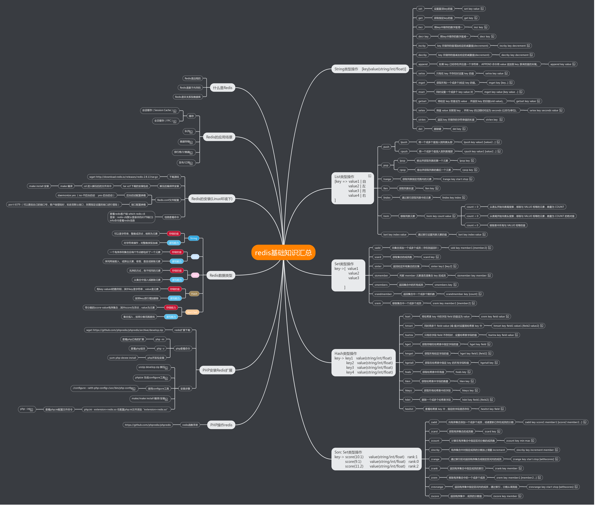

redis是一个开源的支持多种数据类型的key=>value的存储数据库。支持字符串、列表、集合、有序集合、哈希五种类型

图片过大，请下载到本地打开

### redis 和memcache区别

1. Redis不仅仅支持简单的k/v类型的数据，同时还提供list，set，hash等数据结构的存储。 

2. Redis支持数据的备份，即master-slave模式的数据备份。

3. Redis支持数据的持久化，可以将内存中的数据保持在磁盘中，重启的时候可以再次加载进行使用。

### 特性 
- 开源BSD，key-value 存储，c 语言编写
- 高性能，提供多种语言的 API / SET 每秒 11 万次 GET每秒 81000 次
- 数据完全存放在内存中，支持数据的持久化，支持master-slave模式的数据备份
- value 可以是字符串，(hash)Map，列表(List)，集合(Set)，有序集合(sorted set)

### 可用场景
- 取最新的 N 个数据
- 排行榜，取top N个数据
- 精确的设置过期时间(验证码 cookie等等)
- 计数器
- 实时系统，反垃圾系统
- Pub，Sub构建实时消息系统（发布订阅）
- 构建消息队列
- 缓存

### redis五种类型

#### 字符串

> set 、get、append、strlen

### 列表

> lpush lpop rpop rpush llen  lrem lset lrange

#### 集合 

> sadd、smembers、sdiff、spop 、srem、scard

#### 有序集合

> zadd、 zcount、zrem、zrank、

#### 哈希

> hset、hget、hmget、hmset、hkeys、hlen、hsetnx、hvals

[redis 官网](https://github.com/phpredis/phpredis/)