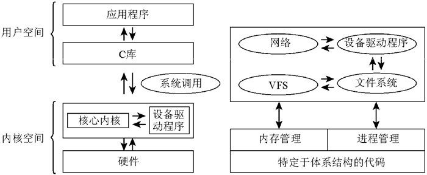

# 内核

## 内核的任务

- 对硬件的访问，应用程序只需发出传输数据的命令，内核抽象了相关的细节，
- 资源管理程序，内核负责将可用共享资源（包括CPU时间、磁盘空间、网络连接等）分配到各个系统进程
- 提供库，执行应用程序发送的系统调用

## 分类

- 微内核

    只有基本的功能由内核实现，其他功能（文件系统、内存管理）委托特定的进程，通过明确定义的通信接口与内核通信
    系统调用由外部的进程完成
    好处：动态可扩展性和在运行时切换重要组件
    坏处：组件间的通信需要额外的CPU时间

- 宏内核

    内核的全部代码，包括所有子系统（如内存管理、文件系统、设备驱动程序）都打包到一个文件中。内核中的每个函数都可以访问内核中所有其他部分

Linux属于宏内核，但是`模块`可以在系统运行中插入到内核代码，向内核动态添加功能

## 内核的组成部分

