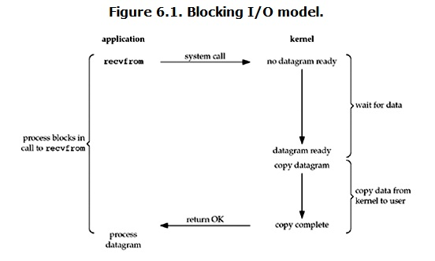
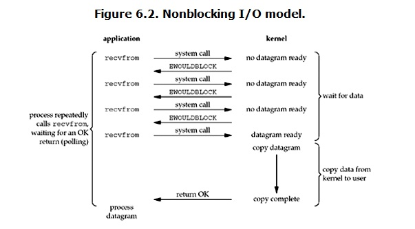
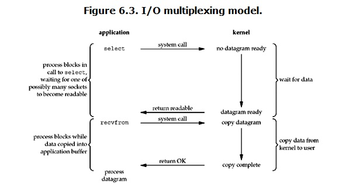
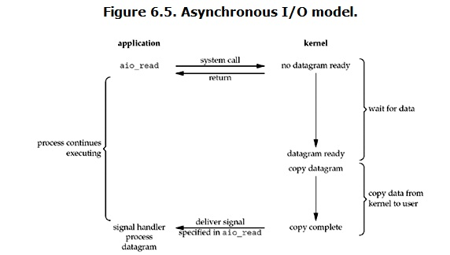

## 概念说明

### 1. 内核空间、用户空间

操作系统的核心是内核，独立于其他应用程序，可以访问底层会保护的硬件，Linux**为了防止用户进程直接操作内核**，将虚拟地址空间，分成了用户空间和内核空间，用户空间就是用户进程所在的空间。

### 2. 进程切换

为了控制进程的执行，内核必须有能力挂起正在CPU上运行的进程，并恢复以前挂起的某个进程的执行。这种行为被称为进程切换。因此可以说，任何进程都是在操作系统内核的支持下运行的，是与内核紧密相关的 

从一个进程的运行转到另一个进程上运行，这个过程中经过下面这些变化：

> 1. 保存处理机上下文，包括程序计数器和其他寄存器。
> 2. 更新PCB信息。
> 3. 把进程的PCB移入相应的队列，如就绪、在某事件阻塞等队列。
> 4. 选择另一个进程执行，并更新其PCB。
> 5. 更新内存管理的数据结构。
> 6. 恢复处理机上下文。

 

 ### 3. 进程的阻塞

>  正在执行的进程，由于期待的某些事件未发生，如请求系统资源失败、等待某种操作的完成、新数据尚未到达或无新工作做等，则由系统自动执行阻塞原语(Block)，使自己由运行状态变为阻塞状态。可见，进程的阻塞是进程自身的一种主动行为，也因此只有处于运行态的进程（获得CPU），才可能将其转为阻塞状态。`当进程进入阻塞状态，是不占用CPU资源的`。 

### 4. 进程缓存区、内核缓冲区

缓冲区的出现是为了减少频繁的系统调用，由于系统调用需要保存之前的进程数据和状态等信息，而结束调用之后回来还需要回复之前的信息，为了减少这种耗时耗性能的调用于是出现了缓冲区。在linux系统中，每个进程有自己独立的缓冲区，叫做**进程缓冲区**，而系统内核也有个缓冲区叫做**内核缓冲区**。

 **操作系统使用read函数把数据从内核缓冲区复制到进程缓冲区，write把数据从进程缓冲区 复制到内核缓冲区中** 

### 5. 文件描述符fd

文件描述符（File descriptor）是计算机科学中的一个术语，`是一个用于表述指向文件的引用的抽象化概念`。 文件描述符在形式上是一个非负整数。实际上，`它是一个索引值，指向内核为每一个进程所维护的该进程打开文件的记录表`。当程序打开一个现有文件或者创建一个新文件时，内核向进程返回一个文件描述符。在程序设计中，一些涉及底层的程序编写往往会围绕着文件描述符展开

## Linx/Unix 5种IO模型 

当一个io发生时候的，涉及到的步骤和对象

以网络socket的 read为例子。

涉及到的对象

- 一个是调用这个IO的process (or thread) （用户进程）
- 一个就是系统内核(kernel)

经历的步骤

- 等待数据准备,比如accept(), recv()等待数据 
- 将数据从内核拷贝到进程中, 比如 accept()接受到请求,recv()接收连接发送的数据后需要复制到内核,再从内核复制到进程**用户空间** 

### 阻塞IO



> 当用户进程调用了recvfrom这个系统调用，kernel就开始了IO的第一个阶段：准备数据（对于网络IO来说，很多时候数据在一开始还没有到达。比如，还没有收到一个完整的UDP包。这个时候kernel就要等待足够的数据到来）。这个过程需要等待，也就是说数据被拷贝到**操作系统内核的缓冲区**中是需要一个过程的。而在用户进程这边，整个进程会被阻塞（当然，是进程自己选择的阻塞）。当kernel一直等到数据准备好了，它就会**将数据从kernel中拷贝到用户内存**，然后kernel返回结果，用户进程才解除block的状态，重新运行起来。


 ### 非阻塞IO



 当用户进程发出read操作时，如果kernel中的数据还没有准备好，**那么它并不会block用户进程，而是立刻返回一个error**。从用户进程角度讲 ，它发起一个read操作后，并不需要等待，而是马上就得到了一个结果。用户进程判断结果是一个error时，它就知道数据还没有准备好，于是它可以再次发送read操作。一旦kernel中的数据准备好了，并且又再次收到了用户进程的system call，那么它马上就将数据拷贝到了用户内存，然后返回

### I/O 多路复用（ IO multiplexing）

IO multiplexing就是我们说的select，poll，epoll，有些地方也称这种IO方式为event driven IO。select/epoll的好处就在于单个process就可以同时处理多个网络连接的IO。它的基本原理就是select，poll，epoll这个function会不断的轮询所负责的所有socket，当某个socket有数据到达了，就通知用户进程。 



在一个调用中阻塞`select`，等待数据报套接字可读。当`select` 返回套接字可读时，我们然后调用`recvfrom` 将数据报复制到我们的应用程序缓冲区中 .使用`select`需要两次系统调用而不是一次 

在IO multiplexing Model中，实际中，**对于每一个socket，一般都设置成为non-blocking，因为只有设置成non-blocking 才能使单个线程/进程不被阻塞（或者说锁住），可以继续处理其他socket。如上图所示，整个用户的process其实是一直被block的。只不过process是被select这个函数block，而不是被socket IO给block。**

### 异步 I/O



用户进程发起read操作之后，立刻就可以开始去做其它的事。而另一方面，从kernel的角度，当它受到一个asynchronous read之后，首先它会立刻返回，所以不会对用户进程产生任何block。然后，kernel会等待数据准备完成，然后将数据拷贝到用户内存，当这一切都完成之后，kernel会给用户进程发送一个signal，告诉它read操作完成了

### 异步、同步、阻塞、非阻塞

同步就是一个任务的完成需要依赖另外一个任务时，只有等待被依赖的任务完成后，依赖的任务才能算完成，这是一种可靠的任务序列 

异步是不需要等待被依赖的任务完成，只是通知被依赖的任务要完成什么工作，依赖的任务也立即执行，只要自己完成了整个任务就算完成了 

阻塞调用是指调用结果返回之前，当前线程会被挂起，一直处于等待消息通知，不能够执行其他业务 

非阻塞调用指在不能立刻得到结果之前，该函数不会阻塞当前线程，而会立刻返回 

异步、同步是发生在用户空间内，当用户发起一个IO的调用的时候，同步的时候，如果这个操作比较耗时间，会阻塞后面的流程

```php
file_get_contents("http://www.qq.com/");
echo "end";
```

调用read的操作的时候。后面的操作echo 会等待上面的结果完成，才能继续。


```php
aysnc_read("http://www.qq.com",function($data){
    echo $data;
})
    echo "end";
```

这个aysnc_read 是一个异步读的操作，当读的时候，底下的操作不会阻塞住，会先输出end。当数据到达的时候，再echo $data;

阻塞、非阻塞、发生在内核和用户空间之间。阻塞是指操作系统会挂起进程，直到数据准备好，非阻塞、操作系统不阻塞，当前进程可以继续执行。

举例说明

- 阻塞io

张三去书店买书，然后问书店问老板，有没有《红楼梦》，老板说我查下，这个查询的时间，比较长，然后张三啥都不能干，就在等着。直到老板告诉它，找到了。然后买了这个书，走了。张三的操作都是同步阻塞的，必须等待老板的结果，下面的操作才能执行。

- 非阻塞IO

还是张三去买书，老板去查询。这是时候，张三可以玩手机，然后隔段时间问，找到了没有，张三的进程没有被阻塞。但是这个任务是同步的，必须等待这个结果。就是老板没有告诉张三结果，张三是不能离开干其他的事。这个过程是同步非阻塞的。

- 异步IO

张三去买书。然后去书店问老板有没有了。老板需要查询，张三告诉老板自己的手机号，找到了打电话给我，然后就去干其他的事了。这个过程是异步的。张三的进程没有被阻塞在这个买书的环节上。这就是异步非阻塞。


## 同步和异步:
同步与异步的重点在消息通知的方式上，也就是调用结果通知的方式。

同步：当一个同步调用发出去后，调用者要一直等待调用结果的通知，直到得到调用结果。

异步：当一个异步调用发出去后，调用者不能立即得到调用结果的返回。

异步调用，要想获得结果，一般有两种方式：
1、主动轮询异步调用的结果;
2、被调用方通过callback来通知调用方调用结果。

### Select

监视并等待多个文件描述符的属性变化（可读、可写或错误异常）。select函数监视的文件描述符分 3 类，分别是writefds、readfds、和 exceptfds。调用后 select会阻塞，直到有描述符就绪（有数据可读、可写、或者有错误异常），或者超时（ timeout 指定等待时间），函数才返回。当 select()函数返回后，可以通过遍历 fdset，来找到就绪的描述符，并且描述符最大不能超过1024

### poll：
poll的机制与select类似，与select在本质上没有多大差别，管理多个描述符也是进行轮询，根据描述符的状态进行处理，但是poll没有最大文件描述符数量的限制。poll和select同样存在一个缺点就是，包含大量文件描述符的数组被整体复制于用户态和内核的地址空间之间，而不论这些文件描述符是否就绪，它的开销随着文件描述符数量的增加而线性增大。

### epoll:
　相对于select和poll来说，epoll更加灵活，没有描述符限制,无需轮询。epoll使用一个文件描述符管理多个描述符，将用户关系的文件描述符的事件存放到内核的一个事件表中。

简单点来说就是当连接有I/O流事件产生的时候，epoll就会去告诉进程哪个连接有I/O流事件产生，然后进程就去处理这个进程。


转载：https://github.com/xianyunyh/PHP-Interview/blob/master/Linux/LinuxIO%E6%A8%A1%E5%9E%8B.md