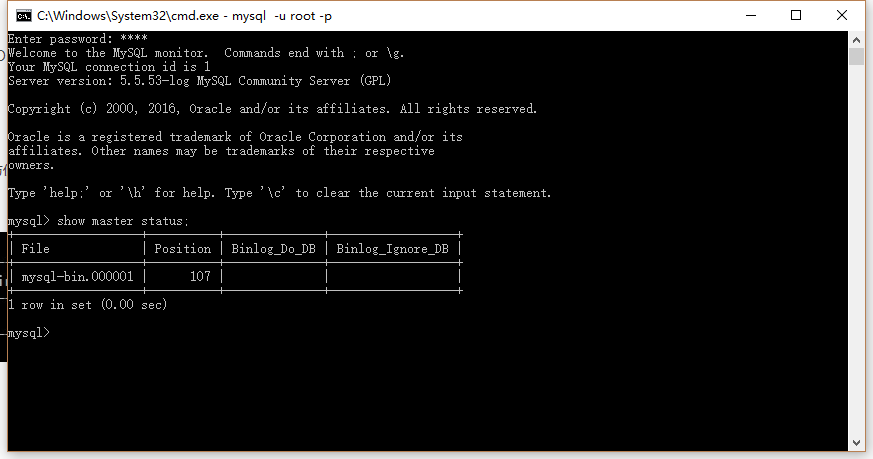

MySql并发

分布式数据库、读写分离、高可用负载均衡、增加缓存服务器


主从复制

192.168.1.1  为主数据库服务器

192.168.1.2  为从数据库服务器

第一步在192.168.1.1中添加一个用户
```
mysql>GRANT REPLICATION SLAVE ON *.* TO 'mysql01'@'192.168.1.2' IDENTIFIED BY 'mysql01';

mysql>FLUSH PRIVILEGES;
```
第二步：查看192.168.1.1服务器二进制文件名与位置

mysql>show master status;



第三步：配置192.168.1.2从服务器
```
mysql>CHANGE MASTER TO
>MASTER_HOST='192.168.1.1',
>master_port=3306,
>MASTER_USER='mysql01',
>MASTER_PASSWORD='mysql01',
>MASTER_LOG_FILE='mysql-bin.000001',
>MASTER_LOG_POS=107;
```

第四步：测试

在192.168.1.2中

mysql>START SLAVE;   #开启复制

mysql>SHOW SLAVE STATUS\G   #查看主从复制是否配置成功

当看到Slave_IO_Running: YES、Slave_SQL_Running: YES才表明状态正常

### 主主复制

--192.168.1.1

server-id=1   #任意数n，只要两台MySQL主机不重复就可以了

log-bin=mysql-bin   #开启二进制日志

auto_increment_increment=2   #步进值auto_imcrement。一般有n台主MySQL就填n

auto_increment_offset=1   #起始值。一般填第n台主MySQL。此时为第一台主MySQL

binlog-ignore=mysql   #忽略mysql库

binlog-ignore=information_schema   #忽略information_schema库

replicate-do-db=abc   #要同步的数据库，默认所有库

--192.168.95.12

server-id=12

log-bin=mysql-bin

auto_increment_increment=2

auto_increment_offset=2

replicate-do-db=abc

配置好后重启MySQL

第一步在192.168.1.2中添加一个用户
```
mysql>GRANT REPLICATION SLAVE ON *.* TO 'mysql02'@'192.168.1.1' IDENTIFIED BY 'mysql02';

mysql>FLUSH PRIVILEGES;
```
第二步：查看192.168.1.2服务器二进制文件名与位置

mysql>show master status;


第三步：配置192.168.1.1从服务器
```
mysql>CHANGE MASTER TO
>MASTER_HOST='192.168.1.2',
>master_port=3306,
>MASTER_USER='mysql02',
>MASTER_PASSWORD='mysql02',
>MASTER_LOG_FILE='mysql-bin.000002',
>MASTER_LOG_POS=107;
```

### 常见问题
 1. 主主复制配置文件中auto_increment_increment和auto_increment_offset只能保证主键不重复，却不能保证主键有序。

 2. 当配置完成Slave_IO_Running、Slave_SQL_Running不全为YES时，show slave status\G信息中有错误提示，可根据错误提示进行更正。

 3. Slave_IO_Running、Slave_SQL_Running不全为YES时，大多数问题都是数据不统一导致。


 常见出错点：

 1. 两台数据库都存在db数据库，而第一台MySQL db中有tab1，第二台MySQL db中没有tab1，那肯定不能成功。

 2. 已经获取了数据的二进制日志名和位置，又进行了数据操作，导致POS发生变更。在配置CHANGE MASTER时还是用到之前的POS。

 3. stop slave后，数据变更，再start slave出错

重新执行一遍CHANGE MASTER就好了。

https://www.cnblogs.com/phpstudy2015-6/tag/mysql/