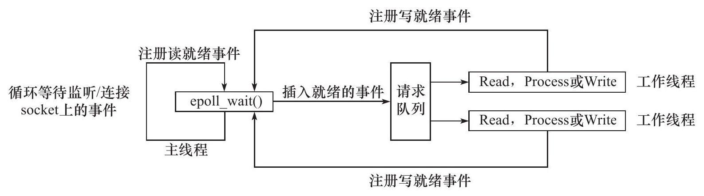

# Reactor模式

Reactor是这样一种模式，它要求主线程（I/O处理单元，下同）只负责监听文件描述上是否有事件发生，有的话就立即将该事件通知工作线程（逻辑单元，下同）。除此之外，主线程不做任何其他实质性的工作。读写数据，接受新的连接，以及处理客户请求均在工作线程中完成。

使用同步I/O模型（以epoll_wait为例）实现的Reactor模式的工作流程是：

1）主线程往epoll内核事件表中注册socket上的读就绪事件。

2）主线程调用epoll_wait等待socket上有数据可读。

3）当socket上有数据可读时，epoll_wait通知主线程。主线程则将socket可读事件放入请求队列。

4）睡眠在请求队列上的某个工作线程被唤醒，它从socket读取数据，并处理客户请求，然后往epoll内核事件表中注册该socket上的写就绪事件。

5）主线程调用epoll_wait等待socket可写。

6）当socket可写时，epoll_wait通知主线程。主线程将socket可写事件放入请求队列。

7）睡眠在请求队列上的某个工作线程被唤醒，它往socket上写入服务器处理客户请求的结果。

工作线程从请求队列中取出事件后，将根据事件的类型来决定如何处理它：对于可读事件，执行读数据和处理请求的操作；对于可写事件，执行写数据的操作。因此，Reactor模式中，没必要区分所谓的“读工作线程”和“写工作线程”