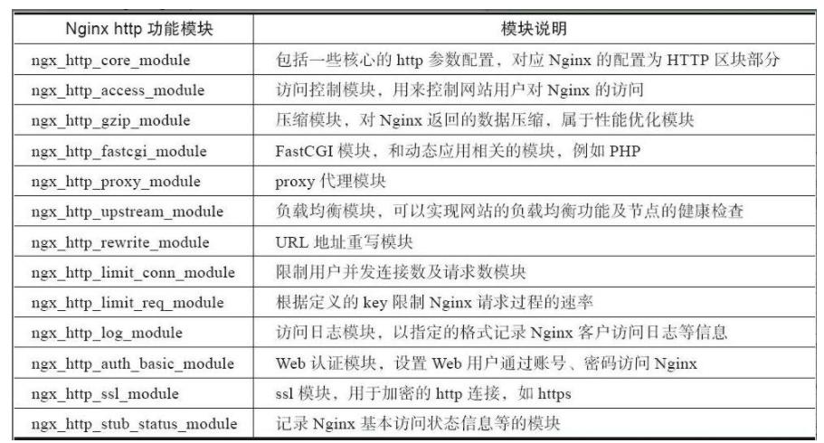

# nginx常用模块



### 配置

`limit_req_zone` 限制单位时间内的请求数，速率限制，使用漏桶算法

    语法:	limit_req_zone $variable zone=name:size rate=rate;
    默认值:	—
    上下文:	http

    设置一块共享内存限制域的参数，它可以用来保存键值的状态。 它特别保存了当前超出请求的数量。 键的值就是指定的变量（空值不会被计算）。 示例用法：

    limit_req_zone $binary_remote_addr zone=one:10m rate=1r/s;
    这里，状态被存在名为“one”，最大10M字节的共享内存里面。对于这个限制域来说 平均处理的请求频率不能超过每秒一次。

    键值是客户端的IP地址。 如果不使用$remote_addr变量，而用$binary_remote_addr变量， 可以将每条状态记录的大小减少到64个字节，这样1M的内存可以保存大约1万6千个64字节的记录。 如果限制域的存储空间耗尽了，对于后续所有请求，服务器都会返回 503 (Service Temporarily Unavailable)错误。

    请求频率可以设置为每秒几次（r/s）。如果请求的频率不到每秒一次， 你可以设置每分钟几次(r/m)。比如每秒半次就是30r/m。


> IP访问控制模块(http_access_module)

对特定的ip允许访问，默认是允许所有ip访问，开启限制使用  `deny all`

    location / {
        deny 192.168.1.1;
        allow 192.168.1.0/24;
        allow 192.168.10.10;
        deny all;
    }

禁止特定文件的访问, `sql|log|txt|jar|war|sh|py|php` 后缀的文件禁止访问

    location ~.*\.(sql|log|txt|jar|war|sh|py|php) {     
        deny all; 
    }

> rewrite 模块（默认安装）

实现URL地址的重定向,根据regex（正则表达式）部分内容，重定向到replacement，结尾是flag标记。 

    语法：rewrite regex replacement [flag]; 
    区块：server, location, if

    flag说明

    last  #本条规则匹配完成后，继续向下匹配新的location URI规则 结束当前的请求处理，用替换后的URI重新匹配location； 可理解为重写（rewrite）后，发起了一个新请求，进入server模块，匹配locaton； 如果重新匹配循环的次数超过10次，nginx会返回500错误；
    break  #本条规则匹配完成即终止，不再匹配后面的任何规则 结束当前的请求处理，
    使用当前资源，不在执行location里余下的语句
    redirect   #返回302临时重定向，浏览器地址会显示跳转后的URL地址 
    permanent  #返回301永久重定向，浏览器地址栏会显示跳转后的URL地址

> rewrite日志

    语法:  rewrite_log on|off;
    默认值: —
    上下文: http,server, location,if

> if指令

检查一个条件是否符合，如果符合执行大括号内的语句。if指令不支持嵌套，不支持多个条件
    区块：server，location

    ~为区分大小写匹配 
    ~*为不区分大小写匹配 
    -f和!-f用来判断是否存在文件 
    -d和!-d用来判断是否存在目录 
    -e和!-e用来判断是否存在文件或目录 
    -x和!-x用来判断文件是否可执行
    if ($http_user_agent~*(mobile|nokia|iphone|ipad|android|samsung|htc|blackberry)) {      
        rewrite  ^(.*)  http://www.baidu.com$1 permanent;
    }

> return指令

    区块：server，location，if
    语法：return code [text]; return URL;

    204（No Content）、400（Bad Request）、402（Payment Required）、403（Forbidden） 404（Not Found）、405（Method Not Allowed）、406（Not Acceptable）、 408（Request Timeout）、410（Gone）、411（Length Required）、 413（Request Entity Too Large）、416（Requested Range Not Satisfiable）、 500（Internal Server Error）、501（Not Implemented）、502（Bad Gateway）、 503（Service Unavailable）和504（Gateway Timeout）。


    如果访问的URL以.sh .php 结尾，返回状态码403 
    
    location ~ .*\.(sh|bash)?$ {
        return 403;
    }

> nginx 防盗链

    根据请求头的Referer判断

    语法:   valid_referers none | blocked | server_names | string ...;
    区块: server, location

    “Referer”请求头为指定值时，内嵌变量$invalid_referer被设置为空字符串， 否则这个变量会被置成“1”。查找匹配时不区分大小写。 该指令的参数可以为下面的内容： none 缺少“Referer”请求头；
    blocked
    “Referer” 请求头存在，但是它的值被防火墙或者代理服务器删除； 这些值都不以“http://” 或者 “https://”字符串作为开头； server_names “Referer” 请求头包含某个虚拟主机名；
    防止别人直接从你网站引用图片等链接，消耗了你的资源和网络流量，那么我们的 就可以设置防盗链策略下面的方法是直接给予404的错误提示，或者是 显示一个图片
    location ~* ^.+\.(jpg|gif|png|swf|flv|wma|wmv|asf|mp3|mmf|zip|rar)$ {    valid_referers none blocked  www.23673.com  23673.com;    if ($invalid_referer) {       #return 302  http://nginx.23673.com/img/nolink.jpg;       return 404;       break;     }

> 缓存
    
    localtion ~*(.img|) {
        expires 30s;
    }

> 负载均衡

负载均衡方法：

- 轮询
- 加权轮询
- IP Hash
- 最少连接数

```
语法:  upstream name { ... }
默认值: —
上下文: http

upstream backend {
    server backend1.com:9500 weight=5 max_fails=10 fail_timeout=10;
    server backend2.com:9501;
}

server {
    location / {
        proxy_pass http://backend;
    }
}
```


参考：

https://tengine.taobao.org/nginx_docs/cn/docs/
