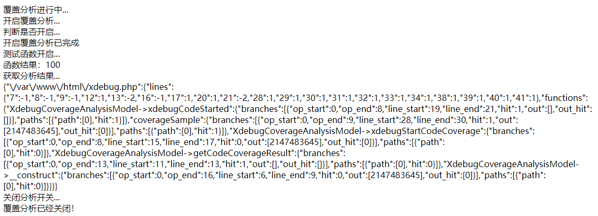
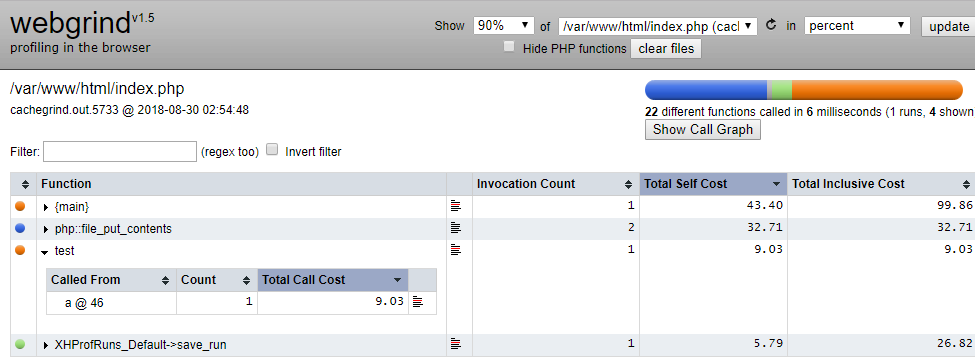

### xdebug 安装

```
wget https://pecl.php.net/get/xdebug-2.6.1.tgz
tar zxf xdebug-2.6.1.tgz
cd xdebug-2.6.1
/usr/local/php7/bin/phpize
./configure --with-php-config=/usr/local/php7/bin/php-config
make && make install
```

### 配置 php.ini
```
vim /usr/local/php7/lib/php.ini
# 最后添加
[xdebug]
zend_extension=xdebug
```

重启php-fpm `service php-fpm restart`

查看是否安装成功

php -m | grep xhprof


xdebug基本调试配置

xdebug.auto_trace = on

xdebug.collect_params = on

xdebug.collect_return = on

xdebug.profiler_enable = on

xdebug.profiler_output_dir ="/php/ext/xdebug_profilers"

xdebug.trace_output_dir = "/tmp/ext/xdebug_traces"

远程调试设置

xdebug.remote_enable = on

xdebug.remote_host = localhost

xdebug.remote_port = 9090 #端口修改

xdebug.remote_autostart = on

更多配置 https://xdebug.org/docs/all_settings

### 跟踪分析

1、代码覆盖分析
通过对代码的覆盖分析，我们可以了解到在IDE访问期间，有哪些代码行数被执行了，有助于对核心代码和单元测试有针对性的了解和分析

A、涉及的配置

xdebug.coverage_enable=1

//该配置默认为1，也就是默认开启，如果设置为0，代码的覆盖分析就不会进行。

 

B、涉及的函数

boolean xdebug_code_coverage_started()

//该函数返回布尔值，用来判断代码覆盖分析功能是否开启，未开启则返回false。

 

void xdebug_start_code_coverage( [int options] )

//该函数没有任何返回，它的作用是开始搜集分析结果集数据，数据是以二维数组形势//存在，一维参数为分析的文件名字，二维参数为对应的分析行数；另外，在分析文件

//的每行代码时，都会产生一个结果码，如下：

//1：代表代码已经执行；

//-1：代表代码未被执行，对应函数参数XDEBUG_CC_UNUSED传入；

//-2：代表没有可执行的代码存在，对应XDEBUG_CC_DEAD_CODE和XDEBUG_CC_UNUSED

 

NOTE:

XDEBUG_CC_UNUSED：用来计算分析时包含搜集未被执行的代码；

XDEBUG_CC_DEAD_CODE：用来计算分析时代码行是否被执行；

形式如下：

xdebug_start_code_coverage(XDEBUG_CC_UNUSED|XDEBUG_CC_DEAD_CODE);

 

array xdebug_get_code_coverage()

//该函数返回数组值，用来搜集和返回代码覆盖分析的结果集信息。

 

void xdebug_stop_code_coverage( [int cleanup=true] )

//该函数不返回任何值，用来停止覆盖分析，如果传入参数为true，那么就会停止分析并清空内存中的分析结果集，否者传入false，反之，还可使用//xdebug_start_code_coverage找回该内存信息。

C、示例的验证

```php
<?php
echo '覆盖分析进行中...</br>';
class XdebugCoverageAnalysisModel {
      private $_coverage_info;
      private $_status;
      function __construct() {
          $this->_coverage_info = xdebug_get_code_coverage();
          $this->_status =xdebug_code_coverage_started();
        }
      // 获取分析结果
      public function getCodeCoverageResult() {
           return json_encode(xdebug_get_code_coverage());
      }
      // 开启覆盖分析
      public function xdebugStartCodeCoverage() {
            xdebug_start_code_coverage( -1 | -2 );
        }
      // 分析是否执行
      public function xdebugCodeStarted() {
           return xdebug_code_coverage_started();
      }
}
// 初始化
$apiModel = new XdebugCoverageAnalysisModel();
echo '开启覆盖分析...</br>';
$apiModel->xdebugStartCodeCoverage();
// 定义一个测试函数
function coverageSample($a,$b) {
   echo '函数结果：'.($a * $b).'</br>';
}
echo '判断是否开启...</br>';
$status = $apiModel->xdebugCodeStarted();
if($status=='1') {
  echo '开启覆盖分析已完成</br>';
} else {
  echo '开启覆盖分析失败了</br>';
}
echo '测试函数开启...</br>';
coverageSample(10,10);
echo '获取分析结果...</br>';
$result = $apiModel->getCodeCoverageResult();
echo $result.'</br>';
echo '关闭分析开关...</br>';
xdebug_stop_code_coverage();
$status = $apiModel->xdebugCodeStarted();
if($status=='1') {
  echo '覆盖分析已经完成</br>';
} else {
  echo '覆盖分析已经关闭！</br>';
}
unset($result);
unset($apiModel);

echo xdebug_get_profiler_filename();
```
运行结果


2、PHP脚本分析
Xdebug的PHP脚本分析功能比较实用，它可以帮助我们分析代码的瓶颈和影响性能缓慢的问题，为优化代码提供可行性的参考。

A、涉及的配置

`xdebug.profiler_enable`

//该配置默认为0，设置为非0之后，即开启profiler功能

`xdebug.profiler_output_dir`

//该配置为上面开启之后，存放生成分析文件的位置，需要保证位置可写入，默认/tmp

`xdebug.profiler_enable_trigger`

//如果开启该选项，则在每次请求中如果GET/POST或cookie中包含//XDEBUG_PROFILE变量名，则才会生成性能报告文件(前提是必须关闭

//xdebug.profiler_enable选项，否则该选项不起作用)。

`xdebug.profiler_output_name`

//可以使用该配置修改生成的分析文件，默认cachegrind.out.%p

NOTE:

建议使用`xdebug.profiler_enable_trigger`替代`xdebug.profiler_enable`

B、涉及的函数

string xdebug_get_profiler_filename()

//返回类型为字符串，用来返回分析的文件名字

C、示例的验证

当我们开启分析开关之后，当有脚本运行就会在指定的位置生成格式为cachegrind.out.xxx的分析文件：
 
 该文件的内容不是很直观，所以需要使用可视化的工具来查看和分析，而Xdebug本身就支持使用第三方的可视化profiler文件的内容。在Linux下，可以使用KCacheGrind，而在Windows平台，可以使用QCacheGrind，当然还有一些在线的由爱好者开发的工具，例如：WebGrind，具体怎样使用这些工具，可以参考：

https://xdebug.org/docs/profiler

WebGrind的效果：

WebGrind可以在这里下载：

https://github.com/jokkedk/webgrind

四、注意事项

1、避免生产环境开启profiler和trace，只需开启远程调试；

2、尽量使用xdebug.profiler_enable_trigger替代xdebug.profiler_enable；

3、如果使用webgrind分析profiler，建议不要放入生产环境，因为其没有安全限制，任何人都可以访问；

4、Xdebug的功能虽然强大，但是要均衡性能开销；

 

五、遇到问题

问题：Error("DbgProtocol instance has no attribute 'stop'",)

产生该问题的原因大致如下：

A、配置文件配置不正确；

B、vscode和php.ini中的port不相同；

参考

https://xdebug.org/

https://blog.csdn.net/why_2012_gogo/article/details/51170609

https://github.com/jokkedk/webgrind
