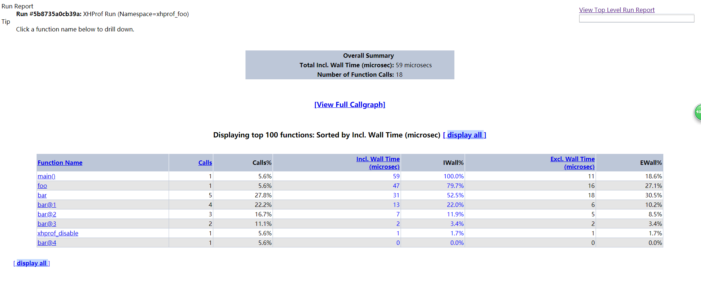

### xhporf 安装
```
# xhprof在PHP的PECL官方上面版本较旧，这里在GitHub上下载xhprof较新的源码
git clone https://github.com/phacility/xhprof
cd xhprof/extension/
phpize
./configure --with-php-config=/usr/local/php7/bin/php-config
make && make install
```

### 配置
- 使用 `php --ini` 查看php.ini位置
- cat /usr/local/php7/lib/php.ini | grep extension_dir
查看扩展保存路径

- 通过vim编辑器编辑配置文件
```
vim /usr/local/php7/lib/php.ini
[xhprof]
extension=xhprof.so
xhprof.output_dir=/data/www/xhprof/save_output_dir 
```

重启php-fpm

查看是否安装成功

php -m | grep xhprof

### 测试

拷贝测试文件到站点跟目录
```
cp -r xhprof/xhprof_html /www
cp -r xhprof/xhprof_lib /www
cp -r xhprof/examples /www
```

- 浏览器访问 `http://127.0.0.1/examples/sample.php`
- 输出 `http://127.0.0.1/index.php?run=5b8735a0cb39a&source=xhprof_foo` 访问该地址


```
// start profiling
xhprof_enable();

// run program
foo();

// stop profiler
$xhprof_data = xhprof_disable();
```

相关网站

http://xhprof.org/

http://php.net/xhprof

https://github.com/phacility/xhprof